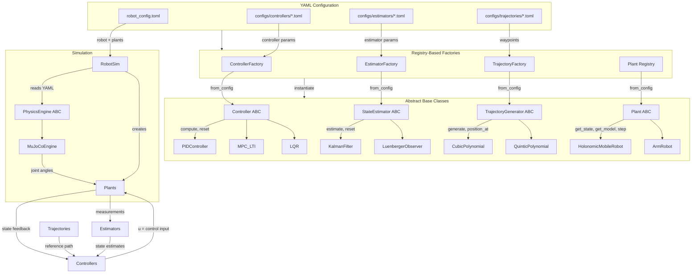

# Lekiwi MPC — Whole-Body Control Framework

A clean, modular control framework built on four abstract base classes — **Controller**, **Plant**, **StateEstimator**, and **TrajectoryGenerator** — with concrete implementations for the lekiwi robot's holonomic base and 6-DOF arm.

## Architecture



## Key Design Decisions

### Registry Pattern
Every concrete class registers itself with a decorator — `@register_controller("LQR")`, `@register_plant("ArmRobot")`, etc. Factories are 3-line generics that look up the class by name from the YAML config. To add a new controller, estimator, trajectory, or plant: create the class, add the decorator + `from_config`, and a YAML config file — no factory code changes.

### YAML-Driven Configuration
All robot, controller, estimator, and trajectory parameters live in YAML files. The same demo script can run LQR or MPC by changing `--controller lqr` to `--controller mpc` — no code changes.

### Separated Physics Engine
The `PhysicsEngine` ABC decouples plants from MuJoCo. `MuJoCoEngine` implements it, but any engine (PyBullet, Drake, Isaac Sim) can be swapped in. Plants talk to the engine through the protocol — no direct MuJoCo imports in plant code.

### Backend-Agnostic Array Operations
All components use an `ArrayBackend` abstraction (`utils/array_backend.py`) instead of calling `np.xxx` directly. Every class accepts an optional `backend` parameter — defaults to `NumpyBackend`, but `TorchBackend` is available for GPU-accelerated or differentiable control pipelines. The backend propagates automatically from the physics engine to plants to controllers.

### Cartesian Arm Abstraction
The arm's `step()` method takes a Cartesian velocity twist `[dx, dy, dz, droll, dpitch, dyaw]`, integrates it into a target pose, runs inverse kinematics internally, and sends joint angles to the servos. The controller **never touches joint space**.

## Project Structure

```
lerobot-mpc-lekiwi/
├── components.py              # ABCs: PhysicsEngine, Controller, Plant, StateEstimator, TrajectoryGenerator
│
├── utils/
│   ├── __init__.py
│   └── array_backend.py       # ArrayBackend ABC + NumpyBackend + TorchBackend
│
├── physics_engine/
│   ├── __init__.py             # Re-exports PhysicsEngine, MuJoCoEngine
│   └── mujoco.py              # MuJoCoEngine — generic, name-based joint access
│
├── factories/
│   ├── __init__.py             # Auto-imports all packages to trigger @register decorators
│   ├── registry.py             # 4 registries + 4 decorators (controller, estimator, trajectory, plant)
│   ├── controller_factory.py   # Generic: lookup → from_config
│   ├── estimator_factory.py    # Generic: lookup → from_config
│   └── trajectory_factory.py   # Generic: lookup → from_config
│
├── simulation/
│   ├── __init__.py             # Exports RobotSim
│   └── robotsim.py             # RobotSim — generic factory from YAML config
│
├── lekiwi_sim.py               # LeKiwiSim — LeKiwi-specific convenience wrapper (backward compat)
│
├── plants/
│   ├── __init__.py
│   ├── armirobot.py            # 6-DOF arm: FK, Jacobian, IK, Cartesian step
│   └── holonomicmobilerobot.py # 3-DOF base with omni-wheel kinematics
│
├── controllers/
│   ├── __init__.py
│   ├── lqr.py                  # LQR with DARE solve
│   ├── pid.py                  # PID with anti-windup
│   └── mpc_lti.py              # MPC with OSQP QP solver
│
├── estimators/
│   ├── __init__.py
│   ├── kalman_filter.py        # Discrete Kalman filter
│   └── luenberger_observer.py  # Luenberger observer
│
├── trajectories/
│   ├── __init__.py
│   ├── cubic_polynomial.py     # 3rd-order, position + velocity continuity
│   └── quintic_polynomial.py   # 5th-order, position + velocity + acceleration continuity
│
├── configs/
│   ├── controllers/
│   │   ├── lqr_base.toml       # LQR weights for base tracking
│   │   └── mpc_base.toml       # MPC horizon, weights, constraints
│   ├── estimators/
│   │   └── luenberger_base.toml # Observer gain
│   └── trajectories/
│       ├── base_straight.toml   # Waypoints for straight line
│       ├── base_triangle.toml   # Waypoints for triangle
│       ├── arm_extension.toml   # Cubic segments for EE motion
│       └── pick_and_place.toml  # Phase list for pick-and-place
│
├── robot_config.toml           # LeKiwi robot definition (auto-generated from XML)
│
├── demos/
│   ├── __init__.py
│   ├── helpers.py              # Shared: renderer, viewer, GIF, plot utilities
│   ├── demo_simple.py          # Terminal-only demo (no graphs, no viewer)
│   ├── demo_arm_trajectory.py  # Arm EE trajectory with live plot + GIF
│   ├── demo_base_tracking.py   # Base tracking with LQR/MPC + observer
│   └── demo_pick_and_place.py  # Full pick-and-place sequence
│
├── scripts/
│   └── generate_robot_config.py # Auto-generate robot_config.toml from MJCF XML
│
├── deprecated/                 # Old demo scripts (moved, not deleted)
│   ├── capture_demo.py
│   ├── capture_gif.py
│   └── demo_base_movement.py
│
├── lekiwi-sim/
│   ├── mjcf_lcmm_robot.xml     # Full robot MuJoCo model
│   ├── so_arm100.xml           # SO-ARM100 arm model (unused)
│   └── meshes/                 # STL meshes for all parts
│
├── test_pick_and_place.py      # Integration tests
├── lab-notes/
│   └── daily/                  # Experiment logs (auto-indexed on commit)
├── AGENTS.md                   # LLM codebase index instructions
├── .codebase/                  # SQLite codebase index (auto-generated)
└── README.md
```

## Quick Start

```bash
# Dependencies
pip install numpy scipy osqp mujoco

# Run a simple terminal demo (no graphs, no viewer)
python -m demos.demo_simple

# Run with GIF capture
python -m demos.demo_simple --gif

# Arm trajectory demo with live viewer
python -m demos.demo_arm_trajectory

# Base tracking with LQR + observer
python -m demos.demo_base_tracking

# Base tracking with MPC
python -m demos.demo_base_tracking --controller mpc

# Triangle path
python -m demos.demo_base_tracking --trajectory triangle

# Headless GIF capture
python -m demos.demo_arm_trajectory --gif
python -m demos.demo_base_tracking --gif --controller mpc --trajectory triangle
python -m demos.demo_pick_and_place
```

## Usage Patterns

### Programmatic (low-level)

```python
from physics_engine import MuJoCoEngine
from plants.armrobot import ArmRobot

engine = MuJoCoEngine("path/to/model.xml")
arm = ArmRobot(num_dof=6, dt=0.02, ...)
arm.physics_engine(engine)
arm.step(np.array([0.05, 0.0, 0.0, 0.0, 0.0, 0.0]))
```

### YAML-driven (generic)

```python
from simulation import RobotSim
from factories import ControllerFactory, TrajectoryFactory

sim = RobotSim("robot_config.toml")
ctrl = ControllerFactory("configs/controllers/lqr_base.toml").create()
schedule = TrajectoryFactory("configs/trajectories/base_straight.toml").create()

for step, target in enumerate(schedule):
    u = ctrl.compute(sim.base.get_state(), target)
    sim.base.step(u)
    sim.step()
```

### Auto-generate config from XML

```bash
python scripts/generate_robot_config.py lekiwi-sim/mjcf_lcmm_robot.xml > robot_config.toml
```

## Controllers

| Controller | Plant | Use Case |
|-----------|-------|----------|
| **PID** | Arm (joint space) | Position servo — send joint angles directly |
| **MPC_DeltaU** | Base (3D) | Trajectory optimization with Δu regularization |
| **LQR** | Base (3D) | Regulation / stabilization |

## State Estimators

| Estimator | Use Case |
|-----------|----------|
| **KalmanFilter** | Optimal state estimation with process/measurement noise |
| **LuenbergerObserver** | Deterministic state estimation with user-specified gain |

## Trajectory Generators

| Generator | Continuity | Config `type` |
|-----------|------------|---------------|
| **CubicPolynomial** | Position + velocity | `cubic_segments` |
| **QuinticPolynomial** | Position + velocity + acceleration | `quintic_segments` |
| **WaypointSchedule** | Piecewise constant | `waypoints` |
| **PhaseSchedule** | Multi-signal (arm + base + jaw) | `phase_list` |

## Adding a New Component

### New controller
```python
@register_controller("MyType")
class MyController(Controller):
    @classmethod
    def from_config(cls, config):
        return cls(...)
```
Create `configs/controllers/my_type.toml` with `type = "MyType"`. Done.

### New plant
```python
@register_plant("MyRobot")
class MyRobot(Plant):
    @classmethod
    def from_config(cls, config):
        return cls(...)
```
Add to `robot_config.toml` under `plants`. Done.

### New physics engine
```python
from components import PhysicsEngine

class MyEngine(PhysicsEngine):
    def get_joint_qpos(self, name): ...
    def set_joint_ctrl(self, name, value): ...
    # ... implement all abstract methods
```
Plants accept it automatically — no changes needed.

## Status

- ✅ PhysicsEngine ABC + MuJoCoEngine (generic, name-based)
- ✅ Base kinematics (3-DOF holonomic)
- ✅ Arm kinematics (6-DOF: FK, Jacobian, IK)
- ✅ Cartesian state + IK-in-step pipeline
- ✅ Trajectory generators: Cubic, Quintic, Waypoint, Phase
- ✅ PID, MPC_DeltaU, LQR controllers
- ✅ KalmanFilter, LuenbergerObserver state estimators
- ✅ Registry-based factories (add via decorator, no code changes)
- ✅ RobotSim — YAML-driven generic simulation factory
- ✅ Auto-generate robot config from MJCF XML
- ✅ YAML-configurable controllers, estimators, trajectories
- ✅ Demo scripts: simple, arm, base tracking, pick-and-place
- 🔄 More trajectory types (min-jerk, trapezoidal, S-curve, Bézier) — *planned*
- 🔄 Shinro IDE integration — *planned*