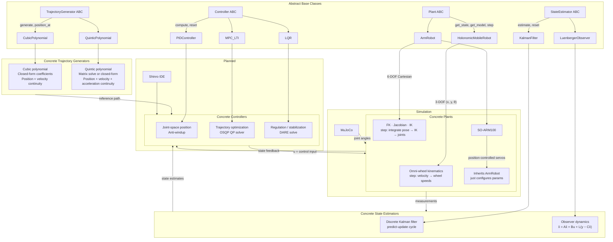

# Lekiwi MPC — Whole-Body Control Framework

A clean, modular control framework built on four abstract base classes — **Controller**, **Plant**, **StateEstimator**, and **TrajectoryGenerator** — with concrete implementations for the lekiwi robot's holonomic base and 6-DOF arm. Designed for the Shinro robotics IDE integration.

## Architecture



## Key Design Decisions

### Cartesian Arm Abstraction
The arm's `step()` method takes a Cartesian velocity twist `[dx, dy, dz, droll, dpitch, dyaw]`, integrates it into a target pose, runs inverse kinematics internally, and sends joint angles to the servos. The controller **never touches joint space** — it thinks it's controlling a 6-DOF Cartesian plant.

```
Controller: [dx, dy, dz, droll, dpitch, dyaw]
    ↓
step(u): state += dt·u → _pose_to_transform() → IK → joint angles
    ↓
Servos
```

### Clean Separation of Concerns
- **Controller** = algorithm (MPC, PID, LQR)
- **Plant** = what you're controlling (base, arm)
- **StateEstimator** = what you measure (KalmanFilter, LuenbergerObserver)
- **TrajectoryGenerator** = reference path (cubic, quintic, more coming)

Swap any controller onto any plant, any estimator onto any plant, any trajectory onto any controller — same interface.

### Verified Kinematics
- Forward kinematics via homogeneous transforms
- Geometric Jacobian verified against numerical differentiation (max error: 0.00018)
- Inverse kinematics with damped pseudoinverse + step clamp (converges from zero to any reachable pose)
- Full round-trip test: Cartesian state → IK → FK → state matches

## Project Structure

```
lerobot-mpc-lekiwi/
├── components.py              # ABCs: Controller, Plant, StateEstimator, TrajectoryGenerator
├── __init__.py                # Package marker
│
├── trajectories/              # Reference path generators
│   ├── __init__.py
│   ├── cubic_polynomial.py    # 3rd-order, position + velocity continuity
│   └── quintic_polynomial.py # 5th-order, position + velocity + acceleration continuity
│
├── controllers/               # Control algorithms
│   ├── __init__.py
│   ├── lqr.py                 # LQR with DARE solve
│   ├── pid.py                 # PID with anti-windup
│   └── mpc_lti.py             # MPC with OSQP QP solver
│
├── plants/                    # Robot models
│   ├── __init__.py
│   ├── armrobot.py            # 6-DOF arm: FK, Jacobian, IK, Cartesian step
│   └── holonomicmobilerobot.py# 3-DOF base with omni-wheel kinematics
│
├── estimators/                # State estimation
│   ├── __init__.py
│   ├── kalman_filter.py       # Discrete Kalman filter
│   └── luenberger_observer.py # Luenberger observer
│
├── lekiwi-sim/                # MuJoCo simulation files
│   ├── mjcf_lcmm_robot.xml    # Full robot model
│   ├── so_arm100.xml          # SO-ARM100 arm model
│   └── meshes/                # STL meshes for all parts
│
├── lekiwi_sim.py              # MuJoCo simulation wrapper
├── demo_base_movement.py      # Base tracking demo (LQR/MPC + observer)
├── capture_gif.py             # Arm extension demo (cubic trajectory + IK)
├── capture_demo.py            # Pick-and-place GIF capture
├── test_pick_and_place.py     # Integration tests
└── README.md
```

## Quick Start

```bash
# Clone
git clone https://github.com/adilfaisal01/lerobot-mpc-lekiwi
cd lerobot-mpc-lekiwi

# Dependencies
pip install numpy scipy osqp

# Generate a smooth trajectory
python3 -c "
import numpy as np
from trajectories import QuinticPolynomial

traj = QuinticPolynomial()
traj.generate(
    start_position=np.array([0.0, 0.0, 0.0]),
    end_position=np.array([1.0, 0.5, 0.3]),
    duration=2.0,
)

for t in [0.0, 0.5, 1.0, 1.5, 2.0]:
    pos, vel, acc = traj.position_at(t)
    print(f't={t:.1f}: pos={pos}  vel={vel}  acc={acc}')
"
```

## Controllers

| Controller | Plant | Use Case |
|-----------|-------|----------|
| **PID** | Arm (joint space) | Position servo — send joint angles directly |
| **MPC_LTI** | Base (3D) | Trajectory optimization for holonomic drive |
| **MPC_LTI** | Arm (6D Cartesian) | End-effector trajectory — IK handles joint math |
| **LQR** | Base (3D) | Regulation / stabilization |

## Trajectory Generators

| Generator | DOF | Continuity | Use Case |
|-----------|-----|------------|----------|
| **CubicPolynomial** | 3D (x, y, z) | Position + velocity | Smooth point-to-point, no accel constraints |
| **QuinticPolynomial** | 3D (x, y, z) | Position + velocity + acceleration | Smooth point-to-point with accel limits, rest-to-rest (min-jerk) |

Both support arbitrary 3D start/end positions via numpy broadcasting — one solve, all dimensions.

## State Estimators

| Estimator | Plant | Use Case |
|-----------|-------|----------|
| **KalmanFilter** | Any LTI system | Optimal state estimation with process/measurement noise |
| **LuenbergerObserver** | Any LTI system | Deterministic state estimation with user-specified gain |

## Status

- ✅ Base kinematics (3-DOF holonomic)
- ✅ Arm kinematics (6-DOF: FK, Jacobian, IK)
- ✅ Cartesian state + IK-in-step pipeline
- ✅ Trajectory generators: CubicPolynomial, QuinticPolynomial
- ✅ PID, MPC_LTI, LQR controllers
- ✅ KalmanFilter, LuenbergerObserver state estimators
- ✅ Organized subpackage structure (trajectories/, controllers/, plants/, estimators/)
- 🔄 Combined state space (base + arm coupling) — *in progress*
- 🔄 More trajectory types (min-jerk, trapezoidal, S-curve, Bézier) — *planned*
- 🔄 MuJoCo closed-loop simulation — *in progress*
- 🔄 Shinro IDE integration — *planned*
